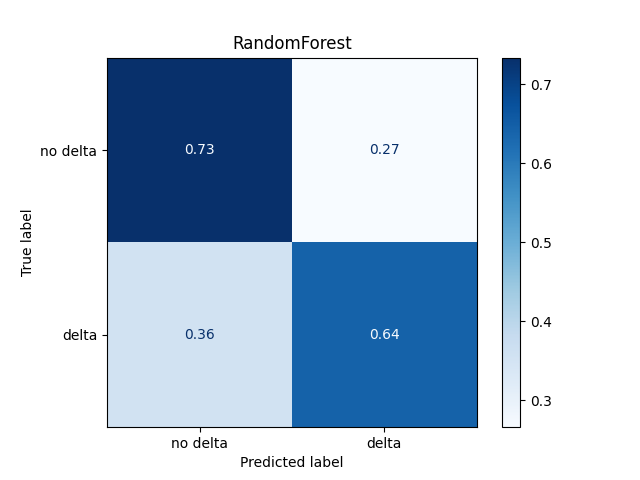
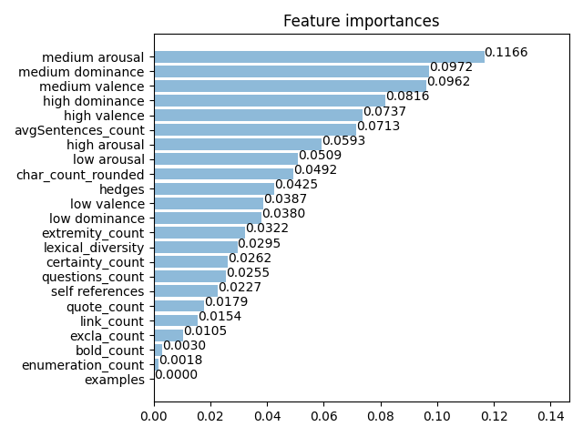

# Change My View
The Reddit forum called r/changemyview, also called CMV, is a forum whose point is to discuss the opinions of individuals and to try to change those original opinions.

CMV has plenty of rules to encourage users to post in a civil manner, as well as rules to ensure replies are also civil.

Here we will use machine learning classifiers to attempt to learn what matters the most in changing the opinions of others in CMV.

You can also checkout our app [CMV Check](https://cmvcheck.herokuapp.com).


---

## The Data
The data was originally obtained from [Changed My View](https://www.reddit.com/r/changemyview/) and can be downloaded on [Raw Data](https://mxlakeforest-my.sharepoint.com/:u:/g/personal/bousquet_mx_lakeforest_edu/Ef-_z-9tZvpBoS_Iv65D7wcBYPUNEu2uCk-qFHClEMPGQA?e=m0n1Bu). (You can also download the [processed data](https://mxlakeforest-my.sharepoint.com/:u:/g/personal/bousquet_mx_lakeforest_edu/Ee_PVcRaz3pClmFPZ6L1aQABZ0Ny7Ft-tl-LoVWPGtFFnw?e=ZiRn7G))

The raw data contained four separate files:
* Comments_TextData.csv
* Comments_MetaData.csv
* Submissions_TextData.csv
* Submissions_MetaData.csv

<br>


The **Comments_TextData.csv** is the data file that contains the body or text of the comments. It has following columns:

<table>
  <tr>
    <th> subreddit </th> <th> created_utc </th> <th> author </th>
    <th> id </th> <th> parent_id </th> <th> body </th> <th> body_html </th>
  </tr>
</table>
<br>

The **Comments_MetaData.csv** is the data file that contains the information about the comments. It has following columns:

<table>
  <tr>
    <th> subreddit_id </th> <th> can_gild </th> <th> score </th> <th> saved </th> <th> gilded </th> <th> replies </th> <th> mod_reports </th> <th> can_mod_post </th> <th> name </th>
  </tr>
  <tr>
  <th> archived </th> <th> parent_id </th> <th> approved_at_utc </th> <th> created </th> <th> author </th> <th> author_flair_text </th> <th> author_cakeday </th> <th> retrieved_on </th> <th> removal_reason </th>
  </tr>
  <tr>
    <th> distinguished </th> <th> approved_by </th> <th> link_id </th> <th> user_reports </th> <th> report_reasons </th> <th> controversiality </th> <th> likes </th> <th> downs </th> <th> banned_by </th>
  </tr>
  <tr>
  <th> created_utc </th> <th> ups </th> <th> edited </th> <th> author_flair_css_class </th> <th> score_hidden </th> <th> num_reports </th> <th> subreddit </th> <th> id </th> <th> stickied </th>
  </tr>
</table>
<br>

The **Submissions_TextData.csv** is the data file that contains the body or text of the submissions or posts. It has following columns:

<table>
  <tr>
    <th> subreddit </th> <th> created_utc </th> <th> author </th>
    <th> id </th> <th> title </th> <th> selftext </th> <th> selftext_html </th>
  </tr>
</table>
<br>

The **Submissions_MetaData.csv** is the data file that contains the information about the submissions or posts. It has following columns:

<table>
  <tr>
    <th> subreddit_id </th> <th> can_gild </th> <th> score </th> <th> saved </th> <th> gilded </th> <th> replies </th> <th> mod_reports </th> <th> can_mod_post </th> <th> name </th>
  </tr>
  <tr>
  <th> archived </th> <th> parent_id </th> <th> approved_at_utc </th> <th> created </th> <th> author </th> <th> author_flair_text </th> <th> author_cakeday </th> <th> retrieved_on </th> <th> removal_reason </th>
  </tr>
  <tr>
    <th> distinguished </th> <th> approved_by </th> <th> link_id </th> <th> user_reports </th> <th> report_reasons </th> <th> controversiality </th> <th> likes </th> <th> downs </th> <th> banned_by </th>
  </tr>
  <tr>
  <th> created_utc </th> <th> ups </th> <th> edited </th> <th> author_flair_css_class </th> <th> score_hidden </th> <th> num_reports </th> <th> subreddit </th> <th> id </th> <th> stickied </th>
  </tr>
  <tr> <th> author_id </th> <th> created </th> <th> original_link </th> <th> stickied </th> <th> score </th> <th> report_reasons </th> <th> created_utc </th> <th> author_flair_css_class </th> <th> subreddit </th> </tr> <tr> <th> secure_media_embed </th> <th> link_flair_css_class </th> <th> media </th> <th> archived </th> <th> saved </th> <th> secure_media </th> <th> ups </th> <th> preview </th> <th> adserver_imp_pixel </th> </tr> <tr> <th> promoted_by </th> <th> url </th> <th> is_self </th> <th> from_kind </th> <th> from </th> <th> retrieved_on </th> <th> media_embed </th> <th> num_comments </th> <th> third_party_tracking_2 </th> </tr> <tr> <th> thumbnail </th> <th> hide_score </th> <th> href_url </th> <th> user_reports </th> <th> thumbnail_width </th> <th> thumbnail_height </th> <th> mobile_ad_url </th> <th> mod_reports </th> <th> likes </th> </tr> <tr> <th> locked </th> <th> imp_pixel </th> <th> third_party_tracking </th> <th> contest_mode </th> <th> distinguished </th> <th> author_flair_text </th> <th> gilded </th> <th> from_id </th> <th> domain </th> </tr> <tr> <th> over_18 </th> <th> promoted </th> <th> hidden </th> <th> promoted_url </th> <th> id </th> <th> can_gild </th> <th> is_video </th> <th> post_hint </th> <th> name </th> </tr> <tr> <th> disable_comments </th> <th> num_reports </th> <th> edited </th> <th> suggested_sort </th> <th> third_party_trackers </th> <th> link_flair_text </th> <th> downs </th> <th> approved_by </th> <th> clicked </th> </tr> <tr> <th> spoiler </th> <th> view_count </th> <th> permalink </th> <th> promoted_display_name </th> <th> subreddit_id </th> <th> author_cakeday </th> <th> adserver_click_url </th> <th> banned_by </th> <th> author </th> </tr> <tr> <th> brand_safe </th> <th> quarantine </th> </tr>
</table>

---

## Quickstart

In order to start, you will need to install the libraries Sklearn, imblearning, Numpy, and matlotlib. Then, you must do is make sure all the inputs and outputs are set correctly.

Based on the names of your input/output files, you may need to create the folders for the output files location before running the code below.

Once this is done, the first step would be to create the data with needed feature, for that you will have to run `createData()` in **main.py** or donwload directly the [processed data](https://mxlakeforest-my.sharepoint.com/:u:/g/personal/bousquet_mx_lakeforest_edu/Ee_PVcRaz3pClmFPZ6L1aQABZ0Ny7Ft-tl-LoVWPGtFFnw?e=ZiRn7G))

Inside the **main.py** file is where the data gets trimmed to only include the information that you need. This speeds up the loading process for the data. You will find the following code in the `if __name__ == '__main__':`:
```python
inputs = ["/home/shared/CMV/RawData/Comments_MetaData.csv", "/home/shared/CMV/RawData/Comments_TextData.csv",
    "/home/shared/CMV/RawData/Submissions_MetaData.csv", "/home/shared/CMV/RawData/Submissions_TextData.csv"]

outputs = ['/home/shared/CMV/SlimmedData/Slimmed_Comments_MetaData.csv',
    '/home/shared/CMV/SlimmedData/Slimmed_Comments_TextData.csv',
    '/home/shared/CMV/SlimmedData/Slimmed_Submissions_MetaData.csv',
    '/home/shared/CMV/SlimmedData/Slimmed_Submissions_TextData.csv']
```
The inputs need to be changed to the location of your saved raw data files, and the outputs need to be changed to the locations you would like to save your slimmed data files.

<br>

Inside the **main.py** is where the comments that receive deltas will be separated from the rest of the comments. You will find the following code in the `run()` function:
```python
input = '/home/shared/CMV/SlimmedData/Slimmed_Comments_TextData.csv'

deltas_file = '/home/shared/CMV/SortedData/delta_winning_ids.txt'
deltas_data_file = '/home/shared/CMV/SortedData/delta_comments_data.csv'
nodeltas_data_file = '/home/shared/CMV/SortedData/nodelta_comments_data.csv'
```
The input needs to be changed to be the Slimmed version of the Comments TextData. The last three are output files what will store the file with the ID's of all delta-winning comments, and the separated Slimmed Data Files for delta-winning comment and nondelta-winning comments.


<br>

Inside the **main.py** is where the comments data will be sampled. It randomly selects a number of comments to train and test on the prediction algorithms. You will find the following code in the `if __name__ == '__main__':`:
```python
delta_file = "/home/shared/CMV/SortedData/delta_comments_data.csv"
nodelta_file = "/home/shared/CMV/SortedData/nodelta_comments_data.csv"

delta_sample_file = "/home/shared/CMV/SampledData/delta_sample_data.csv"
nodelta_sample_file = "/home/shared/CMV/SampledData/nodelta_sample_data.csv"
```
The delta_file is the input file with all the delta-comments data, and the nodelta_file is the location of the input file with all the nodelta-comments data. You can then change the two input sample files to specifiy the location of the output files.  


<br>

Inside the **main.py** is where the comments data will turn into usable numeric features for our data. You will find the following code in the `if __name__ == '__main__':`:
```python
delta_input = "/home/shared/CMV/SampledData/delta_sample_data.csv"
nodelta_input = "/home/shared/CMV/SampledData/nodelta_sample_data.csv"
word_list_input = "../data/word_list.csv"

output_delta = "/home/shared/CMV/FeatureData/delta_sample_feature_data.csv"
output_nodelta = "/home/shared/CMV/FeatureData/nodelta_sample_feature_data.csv"

```
For the inputs, you change their locations to their associated name input. The word_list_input variable gets set to the location of a csv containing more categories/list of words to turn into features. The output files saved are then the locations of the data files with each column as a calculated numeric feature for both delta-winning comments and nondelta-winning comments.


<br>

Once this been completed you can then run the **main.py** file.

`model = models.RandomForet()` creates for us our prediction model.<br>
`X_train, X_test, y_train, y_test = engineer.run(model = model)` separated our data into train and test for accuracy.

Next is to train the model and create our predictions with our model as shown below.
```python
model = model.fit(X_train, y_train)
y_pred = model.predict(X_test)
```

Finally, our model gets scored for us to see the accuracy.
```python
score = accuracy.score(y_pred, y_test)
print(score)
```

## Results

The accaracy of each models is


The confusion matrix for Random Forest



The features importance for Random Forest



## Advanced

### Filtering Data

The original CSV data from the subreddit came as raw data with many columns that were not useful to use thus far in our predictions.
equivalent. The document is also massive so we do cut unnecessary columns from the CSV data.

We have two functions that we use to slim the documents inside of the **slimmer.py** file.


```python
# Takes a single string as inputs for input and output.
# Takes a list of columns you wish to to keep as input for columns.
# Write to the output file name the modified or slimmed data.
slim(input, output, columns)

# Takes a list of string as inputs for input and output.
# Takes a 2d list of columns you wish to to keep as input for columns.
# Write to the output file names the modified or slimmed data.
slim_all(inputs, outputs, columns_lst)
```

### Finding the Deltas

In order to run Prediction Algorithms on the Delta-Winning comments, the Delta-Winning Comments must first be found.
The code searches all comments for either _!delta_ or _Δ_, and adds the parent of the delta comment to a list of
Delta-Winning comments. Some comments that are Delta-Winning may not be in the Meta Data, in which case we add it to
a bad_deltas category, otherwise the comments go into a good_deltas category. Inside the **labeler.py** file there is a function that returns the list of delta comments.


```python
# This takes in the slimmed data as input and sales to the output
# file a list of delta-winning comment ID's.
# Also returns the list of delta-winning comments ID's.
get_deltas(input, output)
```


### Splitting the Deltas and Non Deltas

Once that the deltas have been found, the comments data can not split comments into delta-winning comments or
non-delta winning comments. The command goes through all of the comment data and if they are in our list of deltas,
add them to a list of delta comments, otherwise add them in a list of non-delta comments.
In our **labeler.py** file we have a function that does this.


```python
# The input file is location of our data. The output files are the locations you would like to save the split data into. The delta_files is the location of the file that contain the list of all deltas.
create_labels(input, output_delta, output_nodelta, deltas_file)
```


### Feature Engineering

Then the features must be generated in order to classify our data. The **features.py** file contains all the necessary functions to generate our features file. In order to generate the features and to save them you must run the function:

```python
# the inputs parameter is a list of all files you would like to generate features from.
# The outputs parameter is the list of files you would like to then write to.
# The word_list_input will contain the data for a category of persuasive linguistic features.
# The wanted_features parameter is a string that consists of between 1-4 letters for which features you would like to generate
generateFeatures(inputs, ouputs, word_list_input, wanted_features)
```
If wanted_features contains the letter `'o'`, these features will be generated:
* certainty_count
* extremity_count

If wanted_features contains the letter `'c'`, these features will be generated:


* lexical_diversity_rounded
* char_count_rounded
* link_count
* quote_count
* questions_count
* bold_count
* avgSentences_count
* enumeration_count
* excla_count


If wanted_features contains the letter `'n'`, these features will be generated:
* high arousal
* low arousal
* medium arousal
* medium dominance
* low dominance
* high dominance
* high valence
* low valence
* medium valence
* examples
* hedges
* self references

If wanted_features contains the letter `'v'`, then using a *Count Vectorizer*, we generate a list of vectors containing the count of words in a comment. We then return this vector count as features.


### Classifying

Inside of the **models.py** there are certain preset models that you can use just by setting `model = ModelName()`.

The models you can use are:
* `AdaBoost()`
* `GradientBoosting()`
* `PerceptronClassifier()`
* `LogisticRegressionClassifier()`
* `RandomForest()`
* `MLP()`
* `DecisionTree()`
* `MultinomialNB()`
* `FeedForwardNeuralNetwork()`

### Accuracy

Testing the accuracy is simple. There are two functions that you can use from **accuracy.py** that return to you the accuracy. They are:
* `score(y_pred, y_test)`
* `balancedScore(y_pred, y_test)`

## Generating Comments

In the folder **textgenration** you can find a GPT2 model to generate CMV comments fomr a submission. You can run **train_model.py** and then **generate_text.py**.

For example with the following submission:
> Seeing a person dressed as a woman that is clearly a man will never not be weird.
I know gender dysphoria is real and transgender people exist. I know that the world would be better off accepting that fact.
But in the push to accept transgender people in society, there seems to be this awkward game of pretend that is expected to be played.
It is one thing to simply adjust the pronouns you use to make them comfortable, but it is another thing entirely to be expected to convince yourself that they are the gender in which they identify. If you meet a trans woman that is clearly trans (most notably ones that used to be men with clear male facial features, endomorph or even receding hairlines) you are expected to actually believe she is a woman on a biological level.
There are some very lucky biological men that can transition and be incredibly convincing, but most aren't, and if you aren't one of those lucky people, you will never be seen as an actual woman no matter how much pretend we are expected to play. We can all act like they are women, but the brain already sorts them out as "men dressed as women" way before any conscious decision is made, and it will always be weird and awkward seeing these individuals no matter how nice and accepting we are about it.

Example 1 of generated comment:
> I believe you are missing the point of gender.  The notion of gender is a social construct.  It is not something you can change.  It is a construct that can and should be changed.  In my opinion, gender is not a construct you can actually change.  It is not something that people are forced to "change".  It is a set of behaviors that people can and should mimic.  
The issue with this is that you are saying that being forced to be a woman is like being forced to be a man.  I am not talking about "being forced to be a man..." but "being forced to be a woman is like being forced to be a man."  I would like to think you are aware of this, but I am not.  I am a man, and I am talking about being forced to be a man in a non-threatening manner.  That does not make it any less "manly."  It just makes it a little more "manly."  This is a universal experience, and one that many trans people are forced to face.  I am not saying you should not be forced to be a woman, but I am saying you should be forced to be a man.  I am not talking here about "being forced to be a man is wrong" or "being forced to be a man is wrong."  I am not saying it is okay to be forced to be a man in public, but I am saying it is ok to be forced to be a woman in private.  Just think about how uncomfortable it is for you to be forced to be a man in public, and how uncomfortable it will be for you to be forced to be a woman in the same manner.  I am willing to bet you that many trans people will not be forced to be a woman, but many will.  If you are truly bothered by this, you need to consider what the purpose of the feminine would be in relation to the masculine 

Example 2 of generated comment:
> I would go so far as to say that the transgender community has historically, and purposefully, been underfunded, underfunded, and underfunded.
It's actually been a fairly decent start to my post, but at a really low level. I believe it was around $50M for the whole thing. At that point, I was basically looking for a buzzword, and a typo. I think it was around $20M for the first two movies. They made a deal with the studios to make a second Terminator movie, and they were basically giving us a fourth movie. When that came around, the budgets were basically the same, except for a few minor bits.
I think that's why I believe that the transgender community has had such a negative influence on the rest of Hollywood, and the rest of the entertainment industry. 
I think that it's been an underfunded community, and I think that it's been underfunded for a long time, but I don't think it was the first time that the LGBT community has been underfunded, either. I think you're missing the point. I think the money was spent on the very first two movies, and that the people that made them, the people that made them financially, the people that made them financially, weren't really paying their bills. That's something that are even more relevant now, because of the influence the LGBT community has had on the rest of the entertainment industry, because you didn't have a chance to really have a say in it.
I think that it's been years of intense negotiation, both within the LGBT community and within the industry itself, and it was basically this:
> 1.	How much money should we make to help and defend the community?
> 2.	What do you think of the current high standards of the industry?
> I think that your question is a little fuzzy, and you kind of need to narrow it down a bit. You're really only asking this in the sense that you're asking it in the sense that you're asking it in the sense that you're asking it in the sense that you're asking it in the sense that you're asking it. 
> 
>I think that if you're serious about fighting this, you should talk to some smart people. You need to be willing to negotiate, but you need to be willing to talk to people who are willing to pay for it, and they need to be willing to pay for it. If you're not willing to pay, you're not going to get a decent representation. If you're willing to pay, you're not going to get a good one.
Ultimately, you need to make sure that you're making a good enough case to convince people. If you're not in good company, you should be ashamed of yourself. It's really not a matter of whether or not you're in good company, but who is in good company?
EDIT: Sorry for the lengthy post, but I couldn't find a good post with all of the information I needed. I'll continue to post as I get more and more errors.

Example 3 of generated comment:
>I'm aware that this may be a little off topic, but I'm not going to lie about my attitude towards this. I'm *not* surprised by it. I've been taught that trans people are basically nothing more than caricatures of men, and thus women. I'm not even sure that trans people can be expected to be feminine in any way, but I assume that's the reason behind my *not* taking gender dysphoria personally.
If I were a cis man, I'd be pissed. I'm not saying that I'm against trans people being able to transition, I'm not arguing. But I'm not saying that *men dressed as women*, I'm simply saying that my view is *completely* wrong.
All that said, I do think that there is room for a bit of debate on this. I think that *trans* people should be treated equally, though I do think that trans people can be expected to wear the gender-shifting clothing and hairstyles that they choose, regardless of gender. And I think that trans people can be treated fairly, though I am open to that as well.
But this isn't how it works. I've met a lot of trans people, and I've been treated pretty badly. I'm not saying that I'm feeling bad about it, just that I don't think that it's entirely fair. I think that cis people who complain about being treated like shit are just being transphobic, and that's totally unfair.
